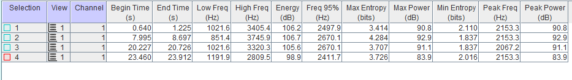

##Descripción de la especie
\
\

Mide 11,5 cm y pesa 19 g. Las timoneras centrales alargadas le agregan de 10 a 15 cm al largo total de los machos adultos, y de 2 a 3 cm al de las hembras. Poseen frente abrupta y patas anaranjadas distintivas.

El macho es eminentemente negro, pero la coronilla, incluso la cresta bífida en la parte de atrás de la coronilla, es de color carmesí resplandeciente. La espalda es azul celeste, y muestra las timoneras centrales largas y muy angostas.
La hembra es verde oliva por encima y en el pecho, y exhibe la garganta más clara con un tinte grisáceo. Por debajo, la región posterior es oliva pálido, y se torna blancuzco en la parte baja del abdomen y la región infracaudal. En raras ocasiones presenta algo de rojo en la coronilla.

Los ejemplares inmaduros requieren de 3 a 4 años para adquirir el plumaje definitivo de adulto; al año tienen la coronilla roja, la cara fusca y las timoneras centrales más o menos alargadas. A los 2 años tienen el resto de la cabeza negruzca, algo de azul en la espalda y negro por debajo. Los especímenes juveniles son similares a la hembra adulta, pero con el abdomen algo más claro.

{width=300px}

##Distribución
\
\
Esta especie se distribuye desde México hasta la parte norte de Costa Rica.

{width=300px}

##Alimentación
\
\

Al igual que otros, estos pájaros comen insectos y bayas. Se alimentan de frutos, especialmente de “tucuico papaturro de pava” (Ardisia revoluta). También comen frutos de “huevos de caballo” (Stemmadenia donnell-smithii). Los individuos de esta especie aparentemente conocen la localización de los árboles en fructificación de su territorio, a los que visitan cada día, cada estación, y año tras año. Se les ha observado consumir frutos de “lagarto jobo” (Sciadodendron excelsum). El saltarín vuela para atrapar frutas, especialmente la de arbustos de sotobosque en hojas oscuras.

##Reproducción
\
\

Parejas o tríos de machos realizan despliegues de cortejo en leks en áreas densas y enmarañadas con buena sombra. Desde estaciones separadas cerca de 30 cm, dos machos (un dominante (alfa) y un subordinado (beta)) realizan saltos en revoloteo, dirigiendo directamente hacia arriba para caer nuevamente en el mismo punto; a medida que aumente el “tempo” del baile, los saltos se vuelven más bajos. En esta danza llamada “el baile de la carreta”, que realizan generalmente cuando hay una hembra en su presencia, cada macho a su turno revolotea hacia arriba y atrás para aterrizar en el punto en que su compañero acaba de dejar libre arrastrándose hacia adelante.

Solo un macho, aquel que con el plumaje de adulto más completo, si es que hay alguna diferencia; copulará con la hembra. El éxito del apareamiento está correlacionado con el porcentaje, duración o persistencia del despliegue de cortejo; esto sugiere que la selección sexual influencia la cantidad de despliegues efectuados por los machos.
Son aves muy sensibles a cualquier tipo de disturbio y los despliegues se interrumpen y se reinician continuamente. Finalmente, cuando el despliegue ha terminado (esto es señalado con una nota de tono alto emitida por un macho dominante (alpha)), un macho ejecuta un único despliegue precopulatorio para la hembra, que para entonces se encuentra en la percha del despliegue. El macho cambia de percha y describe un círculo horizontal (de varios metros de diámetro) alrededor de la hembra; pasa de percha en percha, con un tipo de vuelo flotante muy lento, parecido al vuelo de la mariposa azul (Morpho sp.). Si este despliegue es exitoso, sobreviene la copulación y la hembra se retira sola para criar los pichones.
Los científicos se han preguntado por qué el macho dominante no participa en este momento, a pesar de toda la energía que consume en el ritual de cortejo, cuando no llega a aparearse, a pesar de todo el esfuerzo que ha dedicado a cabo. Ellos han llegado a la conclusión de que parejas de sexo masculino (formadas por un macho alpha y un beta subordinado) permanecen juntos en una amplia relación de hasta diez años, que es particularmente fuerte durante la temporada reproductiva, no solo danzando, pero también realizando tareas más rutinarias. Las parejas de machos aparentemente mantienen la relación también fuera de la temporada reproductiva.

Su nido consiste en una copa poco profunda sujeta por un lado a una horqueta horizontal. Está hecho de micelios de hongos, musgo, hojas de hierbas, pecíolos y telaraña, con hojas secas colgantes en la parte de afuera. Se encuentra a una altura de 6 a 20 dm, casi siempre sobre una quebrada seca o un espacio abierto.
Ponen 2 huevos y menos frecuentemente, uno de color ante, con manchas café chocolate entre escasas o abundantes, que miden de 20,3 a 24 mm de largo y de 15,5 a 18 mm de ancho. Se reproducen de abril a julio.
La hembra remueve las semillas, después que los pichones regurgitan, al igual que los excrementos.

{width=300px}

##Vocalización
\
\

El saltarín colilargo tiene un repertorio vocal particularmente amplio, que posiblemente se explica al derivar de su sistema social complejo y de sus rituales de cortejo. Diferente de otras especies de saltarines, estos no utilizan sonidos mecánicos en sus vcalizaciones, como los estallidos producidos con las alas o con el pico. En cambio, poseen más de treinta llamados. Estos llamados han sido fonéticamente descritos como “toleido”; “uit”; “oung”; “nyanyaounh”; “bazz-uiint”; “tiamuu”; “uiit”; “waanh”; “dududu”; “tudlilu/tuhuiiko/federico”; “juiuo”; “chitter”.

###Sonograma de canto y sus métricas
\
\

###Sonograma de llamado y sus métricas
\
\

