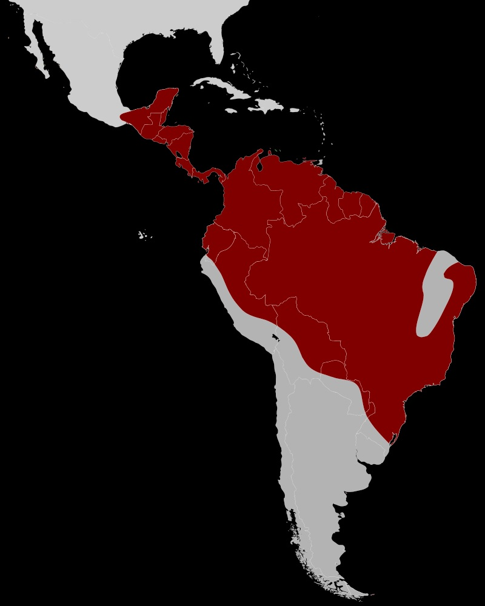

##Caracterización de la familia
\
\

Son pequeños pájaros arborícolas, midiendo entre 7,5 cm (los menores: Tyranneutes virescens y Lepidothrix isidorei ) a 15 cm (el mayor: Chiroxiphia caudata ) de longitud y pesando entre 8 y 30 g. La silueta es compacta, con el pico corto y ancho, y alas cortas. La cola también es corta, excepto en los machos de algunas especies. Los pípridos llamados "típicos" exhiben notable dimorfismo sexual, el plumaje de los machos suele ser principalmente negro con parches de colores muy vivos, y algunas especies muestran colas largas y decorativas o plumas eréctiles del cuello. En algunas especies, los machos entre dos y cuatro años ostentan un vistoso plumaje subadulto de colores vivos. El plumaje de las hembras es menos llamativo, generalmente verdoso.

La siringe, o "caja de voz"" es única y distinta en los pípridos, separándolos de las otras familias parientes Cotingidae y Tyrannidae. Además, varía de forma tan precisa dentro del grupo de géneros, que hasta especies pueden ser identificadas por la siringe en si, diferente de la mayoría de las familias de aves canoras. Los sonidos emitidos son silbidos, trinos y zumbidos.Otros géneros de la familia (Tyranneutes, Neopelma) son de colores más apagados y son más inconspícuos.

##Hábitos alimentarios
\
\

Los saltarines se alimentan en el sotobosque, de pequeñas frutas (pero a menudo bastante grandes para el tamaño de las aves), incluyendo bayas, y en menor grado de insectos. Desde que obtienen las frutas en vuelo, como otras especies cazadoras hacen con insectos, se cree que hayan evolucionado desde aves comedoras de insectos. Las hembras ocupan grandes territorios de los cuales no necesariamente excluyen otras aves de su especie, sino que se alimentan, de alguna forma, socialmente. Los machos gastan la mayor parte de su tiempo en los locales de galanteo. Algunas veces se juntan a bandadas mixtas de alimentación.

##Distribución mundial
\
\
Se distribuyen desde las tierras bajas del sur de México, tanto del golfo, como del Pacífico, por América Central y del Sur, inclusive Trinidad y Tobago, hasta el sur del Perú y norte de Bolivia por el oeste, y hasta el sur de Brasil, este de Paraguay y noreste de Argentina por el este. Algunas especies de altitud realizan migraciones altitudinales.

{width=300px}

La familia cuenta con 54 especies distribuidas en 17 géneros.